import CTABtn from "../../src/components/elements/cta-btn.js"

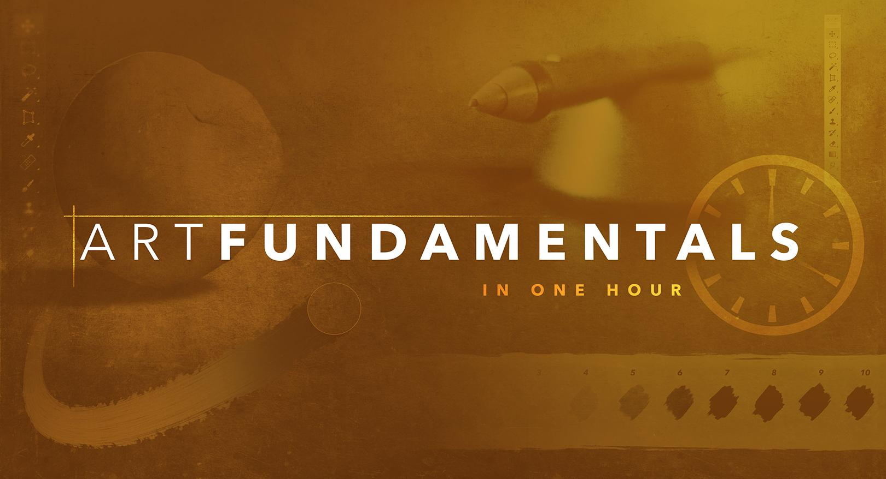

# Best Online Digital Art Courses That Are Worth Paying For

Self teaching is a completely viable route for learning to draw and paint. There are so many great courses you can watch from your home computer that it'd be foolish to ignore this potential.

But there are way too many video courses online that promise to make you a great artist. The truth is that you need to make yourself a great artist; these videos can only act as guides. And with so many options to choose it can be tough knowing where to start.

This post specifically covers the best paid courses that can be streamed online or downloaded to your computer. There are plenty of [free tuts on YouTube](https://conceptartempire.com/free-art-youtube-channels/) but this post will be looking solely at paid options for aspiring artists.

## 1. Proko
I cannot think of a better place to start than the [Proko](https://conceptartempire.com/out/proko/) video courses. Stan Prokopenko is an accomplished fine artist who studied(and now teaches) at the [Watts Atelier](https://www.wattsatelier.com/) in California.

Stan publishes a few video series online teaching artists different techniques that he's learned over the years. Every video is extremely high quality and I recommend you check out his [YouTube channel](https://www.youtube.com/user/ProkoTV/videos) for free video previews.

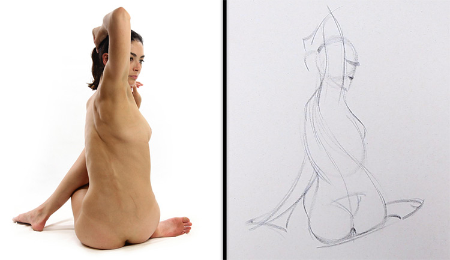

Every video he uploads to YouTube is free, but these free videos are only a small part of his full premium courses.

I started with the [figure drawing course](https://conceptartempire.com/out/proko-figure/) and still get immense value from those lessons. You can read [my full review](https://conceptartempire.com/proko-figure-drawing-fundamentals-review/) if you want more details. But this is the best course for beginners to start with because it teaches the basics of form and how to apply form onto the human figure.

When first starting these lessons I was skeptical. But after practicing them I have seen a tremendous improvement in my work, and it's so easy that even a complete beginner could follow along.

Stan also has a [human anatomy course](https://conceptartempire.com/out/proko-anatomy/) which is truly exquisite. Best anatomy course I've ever seen.

Granted the anatomy course may not be perfect for a total beginner because it's very detailed. But it is the best video course for teaching yourself human anatomy. I also did a [full review](https://conceptartempire.com/proko-human-anatomy-course-review/) of that course if you wanna learn more.

But every new Proko course has incredible recording quality and plenty of detail in the subject matter.

If you were to only learn from one premium course then Proko should be your choice. There are many other great options but Stan has a way with teaching that just makes sense and gets the message across to artists of all skill levels.

<CTABtn href="/">Check out Proko</CTABtn>

## Paintable
The online [Paintable courses](https://conceptartempire.com/out/paintable/) cover absolutely everything about digital art. If you want to get into animation, concept art, webcomics, or anything like that, you're gonna need to learn [digital painting](https://conceptartempire.com/digital-painting/).

And really: this is the absolute best place to get started with digital art.

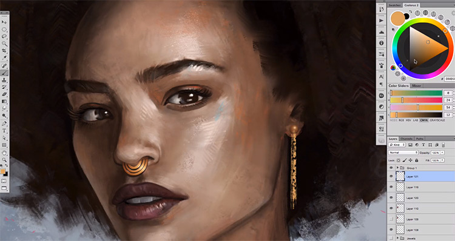

Their library works on a recurring subscription model so you pay a monthly fee but get access to all of their lessons.

The entire course library is incredibly well organized and the videos are split into sections covering every single topic you could imagine. This means detailed portrait painting techniques along with the fundamental basics of digital painting like tablet setup and the purpose of an [artist's glove](https://conceptartempire.com/anti-fouling-glove/).

Each lesson teaches you in Photoshop but the lessons are truly software-agnostic. If you wanna get started in Photoshop that generally is the industry standard. But there's plenty of [other programs](https://conceptartempire.com/digital-painting-software/) including free options like Krita. And they all work for these lessons.

Probably the best thing about Paintable's library is the live mastermind where you can ask questions, share ideas, and gather feedback from other members.

The more you practice art the more you realize that getting learning from others is huge. You can learn so much faster when you have others to offer critiques and technical advice.

You get plenty of this in Paintable's video courses, but you get even *more* from their community.

If you are brand new to art in general I would personally recommend Proko first. You really want to start learning how to draw on paper at the very beginning since the skillset is transferable.

But if your eventual goal is to do anything on the digital side you really want to move over at some point. Thankfully the Paintable lessons do not assume a strong art background so you could start their lessons from any stage of your artistic journey. Just note these lessons do not cover the fundamentals in as much detail as you'll get with a Proko course.

To make it short & sweet: Paintable should be your go-to choice to learn digital painting. I really cannot think of another detailed course library that covers this much stuff on digital painting. Not to mention the community of artists and all the free goodies you get(textures, brushes, etc).

In fact, if you want a free preview of what Paintable offers check out their [free portrait brush pack](https://conceptartempire.com/out/paintable-portrait-brushes/). This comes with a small mini-tutorial and these free brushes are just a small spec of what you get with a full membership.

If you want to get a deeper look at Paintable's content have a peek [at our detailed review](https://conceptartempire.com/paintable-digital-painting-academy-review/) of their digital painting academy series.

<CTABtn href="/">Check out Paintable</CTABtn>

## Digital Painting Studio

[Digital Painting Studio](https://conceptartempire.com/out/digital-painting-studio/) is truly the best online resource for professional concept art training. I know this will not appeal to everyone, but this course library focuses on one thing & does it very well: teaching you how to become a professional entertainment artist.

Whether you want a career doing character design, environments for video games, or general entertainment art for movies or animation, this library has everything you need.

It does have a slant towards concept art so if that's your dream career, definitely check out their membership. They offer a monthly subscription which gives you access to the entire library.

And it's a big library with courses pushing 3-4+ hours, tons of step-by-step demos, and a range of topics:

-   Custom Character Design
-   Environment Painting
-   Concept Art Building & Architecture
-   Creature & Machine Concept Art
-   Photoshop Fundamentals (Great For Beginners)
-   Art Professional Course (Starting Your Career)

It's possible to buy the courses individually, but the monthly rate is only $39/mo and this works out significantly cheaper overall. Not to mention that with a monthly subscription you also get all future courses when they're released.

The instructor (Hardy Fowler) has over 10 years of experience working in this industry. He knows what it takes to get your work in front of an art director. And he knows what kind of skills you'll absolutely need to master to make this your career.

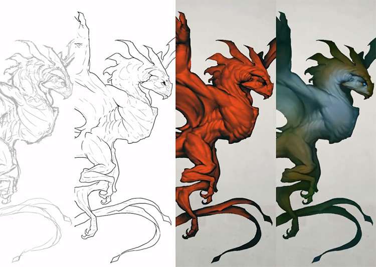

And he's teaching you all of this across a range of courses. These are all self-paced so you can work at your own speed, ideal for anyone who wants to save money avoiding expensive college tuition.

But here's another exclusive feature: Hardy also offers [personal one-on-one mentorships](https://www.digitalpaintingstudio.com/p/mentorship?affcode=138241_qtcfepkl). This is insanely valuable for anyone seriously looking for a career in concept art. It does cost extra, but here's what you can get with Hardy's mentorship:

-   Custom curriculums tailored to your needs
-   Face-to-face learning with private one-on-one sessions
-   Study objectives tailored towards your specific career goals
-   Personalized advice with portfolio choices and how to get noticed for work

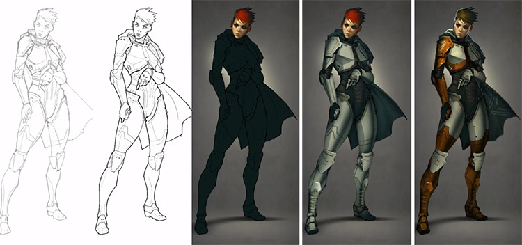

If you're passionate about a career in concept art then [Digital Painting Studio's monthly membership](https://conceptartempire.com/out/digital-painting-studio/) is absolutely the best place to start. It's far cheaper than any college and you get laser-focused lessons designed to help you progress on a career path in this industry.

With the added option of paying extra for access to a one-on-one teacher, I simply cannot imagine a better way to become a working professional in the entertainment art industry.

<CTABtn href="/">Check out Digital Painting Studio</CTABtn>

## Aaron Blaise

Long-time Disney artist Aaron Blaise has his own [series of courses](https://creatureartteacher.com/?ref=conceptart) teaching art & animation---and they're worth every penny.

He worked on a number of animated films like Aladdin, Pocahontas, and The Lion King. He has a passion for drawing animals which you can tell by looking at his [tutorial library](https://creatureartteacher.com/product-category/tutorials-lessons/?ref=conceptart).

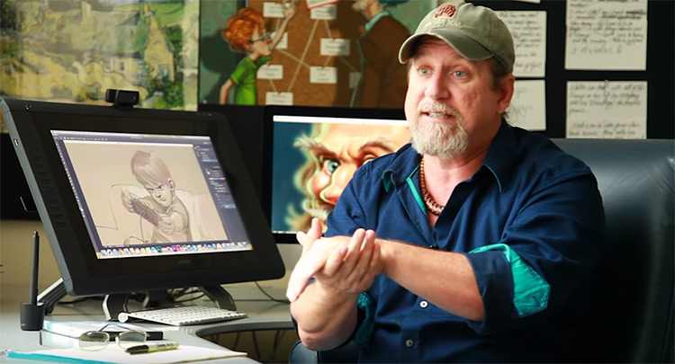

Aaron has different video courses cheaper than others based on depth of information and number of video lessons.

His most popular series is the [Fundamentals of Animation](https://creatureartteacher.com/product/fundamentals-of-animation/?ref=conceptart) coupled with the [Scene Approach](https://creatureartteacher.com/product/animation-scene-approach-course/?ref=conceptart) course for animators.

Aaron's lessons also veer into subjects like anatomy and digital painting. But he is a Disney veteran having worked in the industry for 20+ years. He knows how to animate and does it well.

If you're looking to become a concept artist then Aaron's videos may not be as useful.

But if you have any interest in animation whether movies or TV then I highly recommend his growing library of video courses.

<CTABtn href="/">Check out Aaron's Courses</CTABtn>

## Vitruvian Studio

The [Vitruvian Studio courses](https://conceptartempire.com/out/vitruvian-courses/) by David Jamieson are simply incredible. They cover the fundamentals of art in a way that's easily accessible to beginners who need a strong jumping off point.

Every artist should study [the basic fundamentals](https://conceptartempire.com/what-are-the-fundamentals/) because they play a role in every type of art from concept art to traditional oil painting, from animation to character design and webcomics and everything inbetween.

Complete beginners should start with Vitruvian's [drawing basics course](https://conceptartempire.com/out/vitruvian-drawing-basics/). This teaches the absolute basics of learning how to draw with pencil, and all those techniques transfer nicely into the digital world when you move to a tablet.

Inside "Drawing Basics" you'll find many chapters that break down nicely by subject. You study shapes, forms, and practice drawing basic cubes to really understand how everything you draw can break down into forms.

The final lesson has you drawing some very realistic forms with accurate lighting and proportions: basically everything you'd need to practice to fully develop your artistic skills.

One other course I recommend for beginners is their [cast drawing course](https://conceptartempire.com/out/vitruvian-cast-drawing/) with a focus on realism. This helps you practice two very important skills:

1.  Studying from real life
2.  Translating what you see into a drawing on paper

Every value study you make, every tiny object you study, it all helps to develop your eye to see things the way an artist does. And that's exactly what David's courses aim to teach.

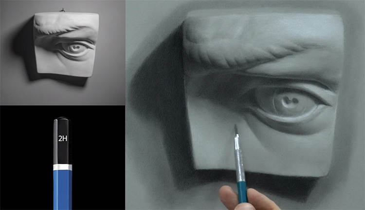

Vitruvian Studio does offer live classes for subjects [like figure drawing](https://conceptartempire.com/what-is-figure-drawing/) but their online courses are truly superb. They also have more in-depth courses on subjects like portrait drawing and oil painting for beginners, although I think those work better for artists with at least a small background in traditional drawing.

But in my eyes there's no question: this is a fantastic library of traditional art content that's guaranteed to help improve your skillset no matter what your goals are.

<CTABtn href="/">Check out Vitruvian Studio</CTABtn>

## Pencil Kings
Professional artists from Marvel, EA, DreamWorks and other major studios all use [Pencil Kings](https://conceptartempire.com/out/pencil-kings/) to sharpen their skills.

This site is great because it's aimed towards everyone from complete beginners to professionals looking to expand their horizons. You can pick from dozens of courses teaching the absolute fundamentals of art, traditional drawing/painting, and modern digital painting for concept art & entertainment art.

This is practically a complete online art school at a *significantly* reduced price.

One great thing about joining Pencil Kings is getting access to their premium art forum. It's only for paid members and it's full of artists from all backgrounds & skill levels.

You can get direct critiques on your work, find advice for practice regimens, and connect with instructors to find out about any new courses coming in the near future. Pencil Kings is constantly updating their library so for the small monthly fee you get direct access to everything.

Currently their library has over 70 courses on topics like anatomy, construction, character design, interior design, and pretty much everything you'd ever want to learn about concept art. But Pencil Kings has lots of courses on related entertainment fields like comics, animation, visual development, and general illustration art.

Take a peek at [their site](https://conceptartempire.com/out/pencil-kings/) for a full list of courses and membership benefits. This is a cheap online course to demo for a month and there's something here for absolutely everyone.

<CTABtn href="/">Check out Pencil Kings</CTABtn>

## New Masters Academy

[New Masters Academy](https://conceptartempire.com/out/nma/) courses do one thing very well: they teach artists how to draw with a deep focus on the fundamentals.

So if you're new to drawing and you want to quickly advance to reach a proficient skillset, the online NMA videos are something you'll want to look into.

Their courses are often used for training at major studios like Pixar and Disney. This is because every artist needs to practice traditionally at some point; and for traditional practice there's nothing better than watching some masters at work.

Take a look at [NMA's courses page](https://conceptartempire.com/out/nma-courses/) to see what I mean. They have a 10 hour course just on [drawing hands](https://conceptartempire.com/out/nma-drawing-hands/). Hands!

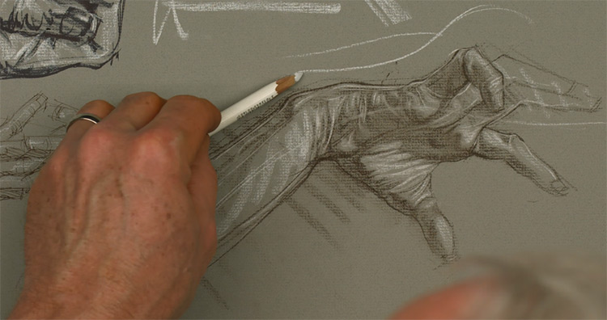

Other courses include a 17 hour [anatomy course](https://conceptartempire.com/out/nma-anatomy-intro/), a massive 48 hour series on [portrait/head drawing](https://conceptartempire.com/out/nma-advanced-head-drawing/), and many other more specific topics like sketching on location or learning to work with oils. And this list barely scratches the surface, you can also find:

-   Animal drawing (21 hours)
-   Composition (30 hours)
-   Animal anatomy (9 hours)
-   Russian-style atelier drawing (51 hours)
-   And seriously, a ton more

Bottom line: NMA is a bit like Proko on steroids. Granted I do prefer the Proko video production quality a lot more, but there's only so much content they've released and those courses can only take you so far.

New Masters Academy bridges the gap and covers a much larger variety of traditional art courses.

They work on a monthly billing cycle so you can sign up for a free account, use it as a trial, and if you like it then you pay a recurring monthly fee kinda like Paintable or Pencil Kings. But New Masters Academy is truly a traditional learning resource.

By now you already know that traditional drawing skills translate crucially into your digital work. So if the traditional drawing stuff is something you really want to improve with, NMA might be the answer.

<CTABtn href="/">Check out New Masters Academy</CTABtn>

## 21 Draw
There's no denying that CGMA is a massively useful online learning resource for digital artists. Animation, storyboarding, concept art, [character design](https://conceptartempire.com/character-design/), you name it and I bet CGMA has a course on it.

Think of [21-Draw](https://conceptartempire.com/out/21draw/) as a cheaper and more personalized approach to learning those topics online.

Their courses are more specific and a bit shorter, but also a whole lot cheaper. They also don't require a live instructor so you can watch 21-Draw videos at your leisure, whenever you have time to practice. No hard time commitment required.

While their offerings are a bit smaller, I also thing they have a unique take on topics like environment concept art & character design. Each course aims to teach you the principles of the art, say for example how to sketch & plan a character.

Then the courses go further into detail with examples showing you how to paint your own works. This is really important because watching someone else work is often 10x better than reading or trying to figure it out on your own.

If you check out [the 21-Draw courses page](https://conceptartempire.com/out/21draw-courses/) you can see what they have available along with a preview for each one. At the moment my top recommendations from their library are these 3 courses:

-   [Environment Design](https://conceptartempire.com/out/21draw-environment-design/)
-   [Character Design](https://conceptartempire.com/out/21draw-character-design/)
-   [Creature Design](https://conceptartempire.com/out/21draw-creature-design/)

Each one is sold separately but you can buy complete access to all courses for one flat price, which brings all the courses down significantly.

This is a pricing model that works really well if you can find value in most of their courses, since you can get them all for a lot cheaper if you buy the full pack together.

Now 21-Draw also offers [some ebooks too](https://conceptartempire.com/out/21draw-ebooks/) and those might be useful if you prefer reading. But I think their best offerings come from their courses which are thorough, easy to follow, and perfect for anyone interested in learning specific techniques for digital art.

<CTABtn href="/">Check out 21 Draw</CTABtn>

## CGMA Classes

Most artists know about the CGMA [online classes](https://2d.cgmasteracademy.com/) run through their website. These classes run at a fixed rate of $699/class which can be very steep for new artists.

But if you're looking to focus on one specific topic then CGMA is likely worth the price. Every class is run online with personal critiques from the teacher. It operates like an online school with a spring, summer, fall, and winter semester.

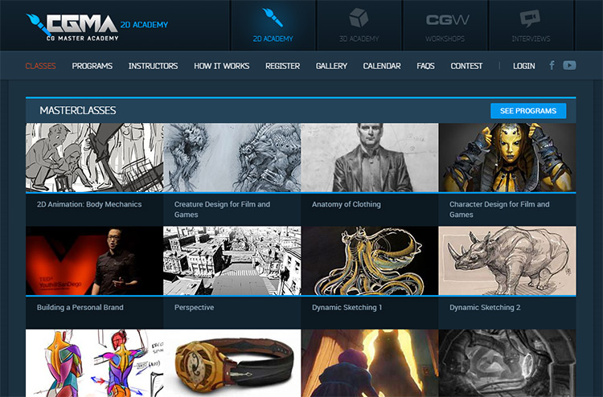

You'll find classes on everything from basic sketching, character art, environment design, lighting, painting, storyboarding, almost everything related [to entertainment art](https://conceptartempire.com/entertainment-art/).

The toughest part of getting in is having enough money and signing up before the classes get too full. There are only so many seats per semester and with master teachers like [Peter Han](http://www.peterhanstyle.com/) it's reasonable to expect a heavy load of registrations.

Again I'd like to say these courses are not geared towards complete beginners. Some have prerequisite skills you must understand before signing up.

And the more skilled you are the easier it'll be to learn from each course.

Think about paying for CGMA once you're a bit past the beginner's stage. These courses will teach you a lot, but they're also fast-paced and you need to be diligent since you're studying by yourself over the Internet.

<CTABtn href="/">Check out CGMA</CTABtn>

##  Gnomon Workshop

The [Gnomon](https://www.gnomon.edu/) school of VFX is widely praised for its detailed teaching style and highly skilled graduates.

This school has been around for years and while they do offer traditional classes on campus, they also have a bunch of [online courses](https://www.gnomon.edu/browse-courses) worth looking into.

Although I feel their best online course library is from [The Gnomon Workshop](https://www.thegnomonworkshop.com/) with dozens of categories covering every facet of entertainment art.

For example, their [anatomy courses](https://www.thegnomonworkshop.com/search?q=anatomy) cover everything from humans to animals. Their human anatomy series spans 7 volumes!

Now when it comes to anatomy, for total newbies I'm still partial to the Proko anatomy series because it covers anatomy at more of a beginner-friendly level.

But Gnomon Workshop's online courses are exceptional and their anatomy course(for example) does not hold back anything.

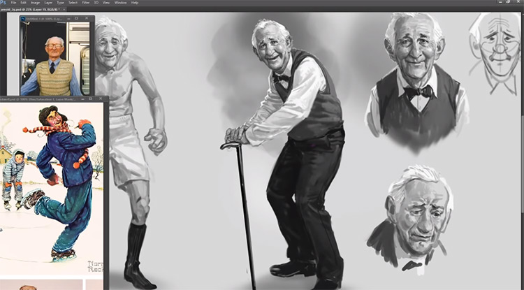

These instructors know what it takes to reach a professional level and land a job in this industry. And that's what they're teaching for.

So is it worth the price?

If you already have a semi-decent background as an artist then Gnomon courses will take you to the next level. If you're a complete beginner then it's much cheaper and smarter to stick with a course series like Proko where you can pay significantly less for videos that are just as detailed.

That said, if you are serious about drawing & painting as a career then Gnomon is absolutely worth bookmarking for later. Check out [this page](https://www.gnomon.edu/courses/online) which has more details about their online course offerings, along with the [Gnomon Workshop drawing category](https://www.thegnomonworkshop.com/tutorials?tags[]=drawing) to see all the courses they have related to 2D art.

<CTABtn href="/">Check out Gnomon Workshop</CTABtn>

## CG Spectrum
[CG Spectrum](https://conceptartempire.com/out/cgspectrum/) is an online art school much like CGMA. But CG Spectrum's courses are more in-depth and you can even pay extra for one-on-one classes.

This site is still geared towards entertainment art so you'll find courses on digital painting, chraracter design, animation, 3D modeling and a lot more.

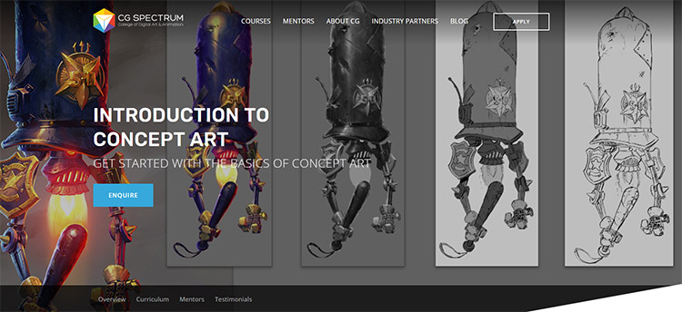

That's one difference about this school from the others: it's not 100% art-driven.

Instead it's entertainment industry driven with the goal of teaching you the stuff you need to land a job.

Each course includes Q&A's with the instructors and detailed video lessons. Most courses run for a few weeks but others offer diploma programs where you'll have a full year's worth of course material. Talk about intense!

If you go with any of their courses you're pretty much guaranteed to improve as an artist. Plus CG Spectrum is a great way to build connections with artists in your class and even instructors. Who you know is huge in the art world.

Unfortunately I can't say that absolute novice artists will find much in CG Spectrum's course load. It's more for artists who already know some fundamentals and want to push forward in one area [like concept art](https://conceptartempire.com/out/cgspectrum-intro-concept-art/). In that case CG Spectrum will take you from a meager artist to a professional in no time.

Worth the money? Absolutely.

Just make sure you read up on their website before joining so you know what you're getting into.

<CTABtn href="/">Check out CG Spectrum</CTABtn>

## The Ultimate Drawing Course - Beginner to Advanced

The Ultimate Drawing Course will show you how to create advanced art that will stand up as professional work. This course will enhance or give you skills in the world of drawing - or your money back

The course is your track to obtaining drawing skills like you always knew you should have! Whether for your own projects or to draw for other people.

This course will take you from having little knowledge in drawing to creating advanced art and having a deep understanding of drawing fundamentals.

<CTABtn href="/">Check out The Ultimate Drawing Course</CTABtn>

## Conclusion

So these are the digital courses that I think offer the most value, especially for aspiring entertainment artists.

Too many art education sites offer junk repetitive content that simply isn't worth the money.

Places that I would avoid are Lynda, Udemy, and Skillshare. Granted none of these sites are 100% bad. However they're better at teaching yourself software rather than art.

If your goal is to radically improve as an artist then I would highly recommend the courses above.

If I had to give specific recommendations I would say [Proko](https://conceptartempire.com/out/proko/) for traditional drawing or for total beginners, then probably [Paintable](https://conceptartempire.com/out/paintable/) for general digital painting, and [Aaron Blaise's courses](https://creatureartteacher.com/?ref=conceptart) for more specifics on entertainment art.

But if you're looking for a career in concept art and want to study it all online, I truly think [Digital Painting Studio](https://conceptartempire.com/out/digital-painting-studio/) is going to be your best option for that.

Either way I hope this list helps on your journey of growth and self-improvement.

The most important thing with learning art is to just keep practicing and never give up.
